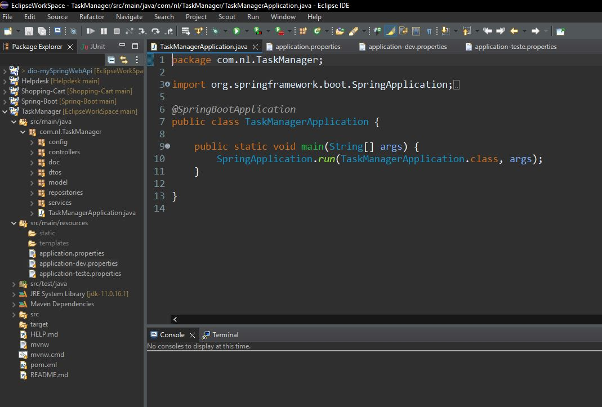
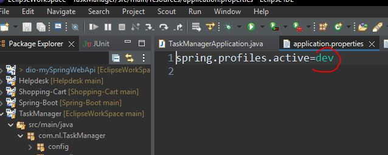
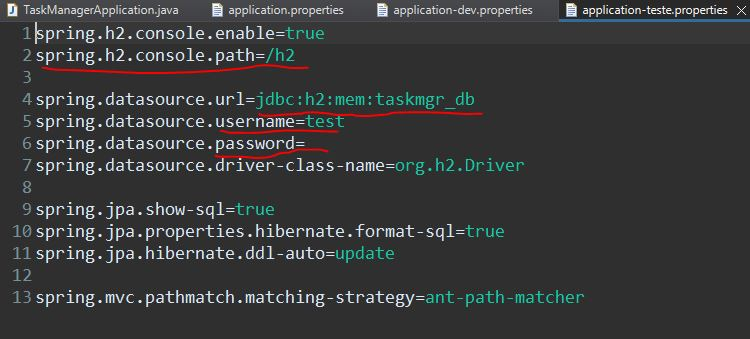
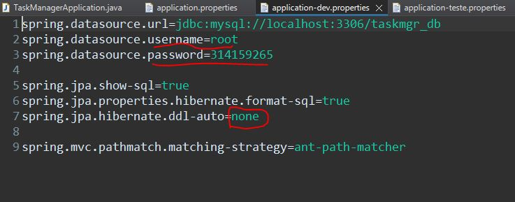

# TaskManager
Esta é uma API Rest para gerencimaneto de tarefas, criada utilizando Java e Spring Boot.

<h3>Tecnicas e ferramentas utilizadas:</h3>

Maven 
JPA; 
Hibernate; 
Injenção de Dependências; 
Banco de dados Relacional(Mysql e H2); 
Objeto de Transferência de dados - DTOs; 
Exception Handler e Exceções personalizadas; 
Angular para front-end:

<h2>Como utilizar</h2>

Primeiro realize o clone do projeto em sua máquina atrvés do terminal do git. 
 
Execute a partir do arquivo <b>TaskManagerApplication</b>  
  

  
Há dois perfis para utilização do banco de dados relacional. Seguem as configurações. 

<h1>Banco em Memória  H2 data base - Perfil "teste"</h1>

Abra o arquivo application.properties em src/main/resources. 
  

  
Altere o valor de "spring.profiles.active=" para spring.profiles.active=teste 
Inicie a aplicação e o banco sera instanciado automaticamente com o nome "taskmgr_db" 
  
  
  
<b>Para acessar o console do H2 entre em http://localhost:8080/h2/console</b> 

<h1>Banco local MySql - Perfil "dev"</h1>

<b>Antes de inicar a aplicação, certifique-se de ter instalado o MySql Server em sua máquina.</b>

Também será necessário criar o banco de dados, podendo ser através do terminal do mysql(configurar variavel de ambiente) ou do mysql workbench. 
Utilize o comando "<b>create database taskmgr_db;</b>"

Após criar o banco, abra o arquivo application.properties em src/main/resources. 
Altere o valor de "spring.profiles.active=" para <b>spring.profiles.active=dev</b> 
Altere os valores de <b>user e password</b> de acordo com a configuração do seu banco. 

<h3>Caso esteja rodando aplicação pela primeira vez, verifique se o valor de "spring.jpa.hibernate.ddl-auto=" está marcado como "update".</h3>.
Ao executar sera feita uma carga inicial de dados com algumas tarefas de exemplo. 
<h3>Após isso, mude o valor de "spring.jpa.hibernate.ddl-auto=" para none.<h3>

